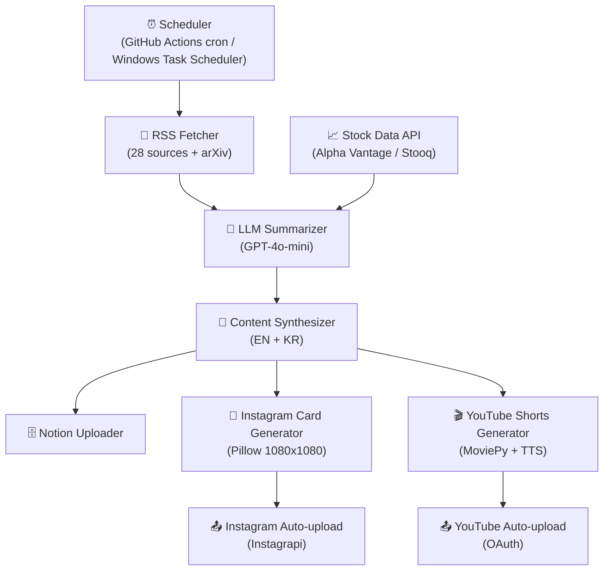

# 🤖 AI InsightLens — Scheduled LLM Content Pipeline

> **Built:** October 2025

> **Collects AI news from 28 sources daily, summarizes with GPT, then auto-publishes YouTube Shorts + Instagram card posts — fully unattended at ~$0.07/day**
> Multi-format content generation from a single LLM call · GitHub Actions cron scheduling · ~$0.07/day cost-optimized pipeline


[](https://opensource.org/licenses/MIT)

---

## 1. Overview

AI news is fragmented across dozens of sources. This pipeline aggregates 28 feeds (arXiv, OpenAI, Anthropic, Google DeepMind, Meta AI, TechCrunch, and more), summarizes them in a single GPT call, and automatically publishes the result as a YouTube Shorts video, an Instagram card post, and a Notion database entry — every morning at 8 AM, with no human intervention.

**Key Value:**
- Fully automated AI news content published daily at 8 AM — zero manual steps
- One LLM summarization call fans out to three output formats (video + image + text)
- Cost-optimized to run at under $2/month

**Supported Sources (28 total):**
- AI Research: arXiv (cs.AI, cs.LG, cs.CL)
- Big Tech: OpenAI, Anthropic, Google DeepMind, Meta AI, NVIDIA, Microsoft
- VC / Investing: TechCrunch, VentureBeat, a16z, Y Combinator
- Market Data: Alpha Vantage / Stooq

---

## 2. Architecture



**Pipeline Stages:**
1. **Collect** — Fetch today's news from 28 RSS / arXiv feeds
2. **Summarize** — Generate 4 key points + market analysis via GPT-4o-mini (EN + KR)
3. **Store** — Upsert daily summary to Notion database
4. **Video** — Generate ~44-second YouTube Shorts via MoviePy + TTS
5. **Image** — Generate 5 Instagram card posts (1080×1080) via Pillow
6. **Upload** — Auto-publish via YouTube OAuth and Instagram Instagrapi

---

## 3. Tech Stack

| Category | Technology |
|----------|------------|
| **LLM** | OpenAI GPT-4o-mini |
| **TTS** | OpenAI TTS API |
| **Video Generation** | MoviePy |
| **Image Generation** | Pillow (PIL) |
| **News Collection** | feedparser (RSS), arXiv API |
| **Stock Data** | Alpha Vantage API, Stooq |
| **Database** | Notion API |
| **YouTube Upload** | YouTube Data API v3 (OAuth) |
| **Instagram Upload** | Instagrapi |
| **Scheduler** | GitHub Actions (cron), Windows Task Scheduler |
| **Language** | Python 3.11+ |

---

## 4. Core Logic

### Token Cost Strategy

```
- Batched summarization: bundle all articles into a single prompt to minimize API calls
- Context window trimming: cap tokens per article to control cost
- Model selection: gpt-4o-mini — ~10x cheaper than gpt-4o, sufficient summary quality
- Estimated daily cost: ~$0.07
```

### Daily Operating Cost (~$0.07/day)

| Item | Cost |
|------|------|
| OpenAI GPT-4o-mini (summarization) | ~$0.02 |
| OpenAI TTS (5 sections) | ~$0.04 |
| OpenAI GPT-4o-mini (card extraction) | ~$0.01 |
| Pillow image generation | Free |
| **Total** | **~$0.07/day (under $2/month)** |

### Content Generation Pipeline

```bash
# Option 1: Run each stage individually
python run_insightlens_ai_only.py        # Collect news + generate summary
python generate_shorts.py summary_*.txt  # Generate YouTube Shorts
python generate_cardnews.py summary_*.txt --lang en --slides 5  # Generate cards
python upload_youtube.py shorts_output/*.mp4 en  # Upload to YouTube
python upload_instagram_simple.py --date 2025-10-09  # Upload to Instagram

# Option 2: Run the full pipeline in one command
python run_full_pipeline.py
```

### GitHub Actions Automation

Three sequential jobs run daily at 8 AM KST:
- **8:00** — News collection & summary generation
- **8:10** — YouTube Shorts generation
- **8:15** — Instagram card generation + upload

```yaml
# .github/workflows/daily_pipeline.yml
on:
  schedule:
    - cron: '0 23 * * *'  # UTC 23:00 = KST 08:00
```

---

## 5. Evaluation

| Metric | Details |
|--------|---------|
| **Pipeline Completion Rate** | Success rate per stage (collect → summarize → video → image → upload); date-stamped logs pinpoint failures |
| **Summary Quality** | Whether 4 key points accurately represent source articles — validated against source links |
| **Content Consistency** | EN/KR version alignment; quality of auto-generated metadata (title, tags, hashtags) |
| **Upload Success Rate** | Failure rate from YouTube OAuth expiry or Instagram session errors |
| **Cost Tracking** | Daily OpenAI token consumption tracked to catch cost anomalies early |
| **Future Improvements** | Engagement-based content quality feedback (views, likes); per-source reliability scoring |

---

## 6. Production Considerations

| Item | Details |
|------|---------|
| **API Failure Handling** | Per-stage error logging isolates failures in the OpenAI / Notion API calls |
| **Rate Limit Handling** | Inter-call delays and 429 backoff handling per API |
| **Duplicate Prevention** | Date-based filenames (`summary_YYYY-MM-DD.txt`) prevent re-generation; Notion upsert prevents duplicate entries |
| **Credential Management** | Secrets managed via `.env` (OpenAI, Notion, Instagram, Gmail); integrated with GitHub Actions Secrets |
| **Large File Management** | Video (.mp4), image (.png), audio (.mp3) outputs excluded via `.gitignore` to prevent repository bloat |
| **YouTube OAuth** | `token.pickle` git-excluded; requires manual re-auth on expiry — a known constraint for fully unattended operation |
| **Instagram Session** | Instagrapi `instagram_session.json` git-excluded; session expiry requires re-login |

---

## 7. Deployment

### Local Setup

```bash
# 1. Clone the repository
git clone https://github.com/pynoodle/scheduled-llm-content-pipeline.git
cd scheduled-llm-content-pipeline

# 2. Create virtual environment
python -m venv .venv
# Windows
.\.venv\Scripts\Activate.ps1
# macOS/Linux
source .venv/bin/activate

# 3. Install dependencies
pip install -r requirements.txt

# 4. Configure environment variables
cp .env.example .env
# Fill in API keys in .env

# 5. Run the full pipeline
python run_full_pipeline.py
```

### Environment Variables (.env)

```env
# Required
OPENAI_API_KEY=sk-proj-your-key-here
NOTION_TOKEN=ntn_your-token-here
NOTION_DB_ID=your-database-id-here

# Optional
INSTAGRAM_USERNAME=your_username
INSTAGRAM_PASSWORD=your_password
ALPHA_VANTAGE_KEY=your-key-here
EMAIL_ENABLE=false
EMAIL_SMTP_HOST=smtp.gmail.com
EMAIL_SMTP_PORT=587
EMAIL_USERNAME=your-email@gmail.com
EMAIL_PASSWORD=your-app-password
EMAIL_FROM=your-email@gmail.com
EMAIL_TO=recipient@gmail.com
```

### GitHub Actions Automation

See [GITHUB_AUTOMATION_GUIDE.md](GITHUB_AUTOMATION_GUIDE.md):
1. Register API keys in GitHub Secrets
2. Enable `.github/workflows/` workflows
3. Runs automatically at KST 8 AM — no local machine required

### Windows Task Scheduler

```bash
# Double-click to run locally
run_daily.bat
```

### Project Structure

```
scheduled-llm-content-pipeline/
├── run_insightlens_ai_only.py    # News collection and summarization
├── generate_shorts.py             # YouTube Shorts generation
├── generate_cardnews.py           # Instagram card generation
├── upload_youtube.py              # YouTube auto-upload
├── upload_instagram_simple.py     # Instagram auto-upload
├── run_full_pipeline.py           # Full pipeline entry point
├── run_daily.bat                  # Windows batch runner
├── .github/workflows/             # GitHub Actions workflows
├── requirements.txt
├── .env.example
├── .gitignore
└── README.md
```

---

## 8. Lessons Learned

**Single Summary → Multi-format Publishing**
- Generating video, image, and text from one GPT output dramatically reduces API cost vs. separate calls per format
- Separating format rendering from content generation also makes each stage independently testable

**GitHub Actions vs. Local Scheduler**
- GitHub Actions: free, serverless automation — but YouTube OAuth token management is non-trivial (pickle file must be base64-encoded as a Secret)
- Windows Task Scheduler: simple to configure, but requires the machine to be on — choose based on reliability requirements

**Practical Limits of Instagram Automation**
- Instagram Graph API (official) requires a Business account + Facebook linkage — high setup complexity
- Instagrapi (unofficial reverse-engineered library) takes 5 minutes to set up but can break on Instagram policy changes — use the official API for anything production-critical

**RSS Source Reliability**
- Several of the 28 sources update irregularly or change feed structure without notice — per-source fallback handling is essential
- arXiv publishes hundreds of papers daily; without category filtering (cs.AI, cs.LG, cs.CL), summary quality degrades significantly

**Cost Control is the Foundation of Automation**
- Choosing GPT-4o-mini over GPT-4o cuts cost ~10x with negligible quality loss for news summarization
- TTS cost scales with text length — explicitly cap section count and length to avoid runaway charges

---

**📞 Project Link:** [https://github.com/pynoodle/scheduled-llm-content-pipeline](https://github.com/pynoodle/scheduled-llm-content-pipeline)

GitHub: [@pynoodle](https://github.com/pynoodle)
