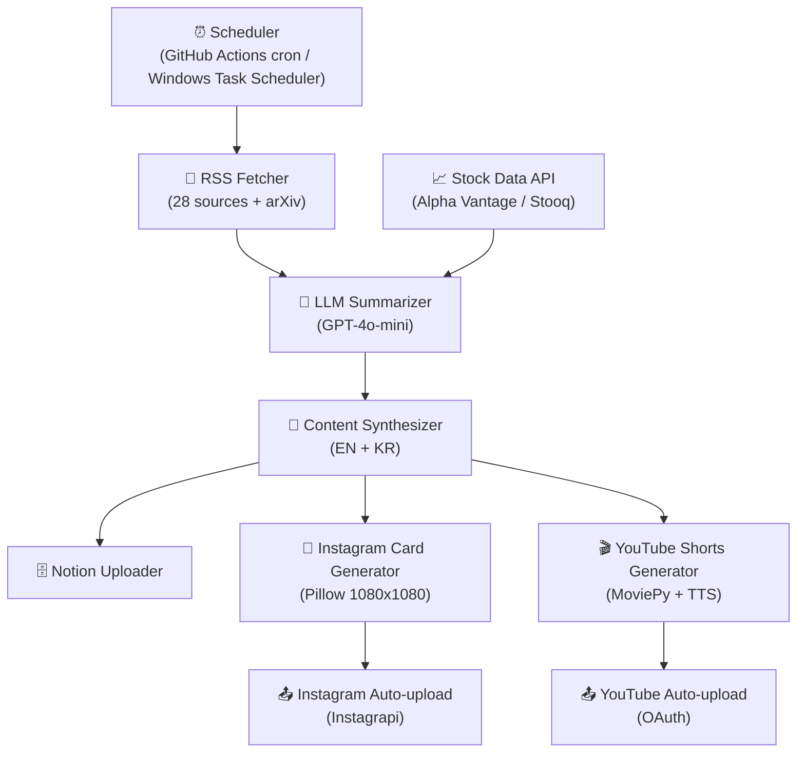

# 🤖 AI InsightLens — Scheduled LLM Content Pipeline

> **Built:** October 2025

매일 자동으로 AI 뉴스를 수집·요약하고 YouTube Shorts + Instagram 카드뉴스를 생성하여 업로드하는 완전 자동화 콘텐츠 파이프라인입니다.
> **28개 AI 뉴스 소스 자동 수집 → GPT 요약 → YouTube Shorts + Instagram 카드뉴스 자동 발행**  
> Multi-format content generation from a single LLM call · GitHub Actions cron scheduling · ~$0.07/day cost-optimized pipeline


[](https://www.python.org/downloads/)
[](https://opensource.org/licenses/MIT)

---

## 1. Overview

AI 뉴스 소비의 파편화 문제를 해결하기 위해, 28개 소스(arXiv, OpenAI, Anthropic, Google DeepMind, Meta AI, TechCrunch 등)에서 뉴스를 자동 수집하고 GPT-4o-mini로 요약한 뒤, YouTube Shorts 영상과 Instagram 카드뉴스를 자동 생성·업로드합니다.

**핵심 가치:**
- 매일 아침 8시, 사람 손 없이 AI 뉴스 콘텐츠 완전 자동 생성
- 단일 요약에서 영상(YouTube) + 이미지(Instagram) + 텍스트(Notion) 3가지 형식 동시 발행
- 월 $2 이하의 비용으로 운영 가능한 경제적 자동화 시스템

**지원 소스 (28개):**
- AI 연구: arXiv (cs.AI, cs.LG, cs.CL)
- 빅테크: OpenAI, Anthropic, Google DeepMind, Meta AI, NVIDIA, Microsoft
- VC/투자: TechCrunch, VentureBeat, a16z, Y Combinator
- 주식 데이터: Alpha Vantage / Stooq

---

## 2. Architecture



**파이프라인 단계:**
1. **수집**: RSS/arXiv에서 당일 뉴스 피드 fetch
2. **요약**: GPT-4o-mini로 핵심 포인트 4개 + 시장 분석 생성 (영어/한글)
3. **저장**: Notion 데이터베이스에 요약 자동 업서트
4. **영상**: MoviePy + TTS로 YouTube Shorts(~44초) 생성
5. **이미지**: Pillow로 Instagram 카드뉴스(1080x1080, 5장) 생성
6. **업로드**: YouTube OAuth + Instagram Instagrapi로 자동 업로드

---

## 3. Tech Stack

| 범주 | 기술 |
|------|------|
| **LLM** | OpenAI GPT-4o-mini |
| **TTS** | OpenAI TTS API |
| **Video Generation** | MoviePy |
| **Image Generation** | Pillow (PIL) |
| **News Collection** | feedparser (RSS), arXiv API |
| **Stock Data** | Alpha Vantage API, Stooq |
| **Database** | Notion API |
| **YouTube Upload** | YouTube Data API v3 (OAuth) |
| **Instagram Upload** | Instagrapi |
| **Scheduler** | GitHub Actions (cron), Windows Task Scheduler |
| **Language** | Python 3.11+ |

---

## 4. Core Logic

### Token Cost Strategy

```
- Batched summarization: 수집된 기사를 단일 프롬프트로 묶어 API 호출 최소화
- Context window trimming: 기사별 최대 토큰 수 제한으로 비용 제어
- Model selection: gpt-4o-mini 선택 — gpt-4o 대비 ~10x 저렴, 요약 품질 충분
- Estimated daily cost: ~$0.07/일
```

### 일일 운영 비용 (약 $0.07/일)

| 항목 | 비용 |
|------|------|
| OpenAI GPT-4o-mini (요약) | ~$0.02 |
| OpenAI TTS (5개 섹션) | ~$0.04 |
| OpenAI GPT-4o-mini (카드뉴스 추출) | ~$0.01 |
| PIL 이미지 생성 | 무료 |
| **합계** | **~$0.07/일 (월 $2 이하)** |

### 콘텐츠 생성 파이프라인

```bash
# 방법 1: 개별 단계 실행
python run_insightlens_ai_only.py      # 뉴스 수집 + 요약 생성
python generate_shorts.py summary_*.txt  # YouTube Shorts 생성
python generate_cardnews.py summary_*.txt --lang en --slides 5  # 카드뉴스 생성
python upload_youtube.py shorts_output/*.mp4 en   # YouTube 업로드
python upload_instagram_simple.py --date 2025-10-09  # Instagram 업로드

# 방법 2: 전체 파이프라인 한 번에
python run_full_pipeline.py
```

### GitHub Actions 자동화

매일 아침 8시 순차 3단계 실행:
- **8:00** — 뉴스 수집 & 요약 생성
- **8:10** — YouTube Shorts 생성
- **8:15** — Instagram 카드뉴스 + 자동 업로드

```yaml
# .github/workflows/daily_pipeline.yml
on:
  schedule:
    - cron: '0 23 * * *'  # UTC 23:00 = KST 08:00
```

---

## 5. Evaluation

| 항목 | 내용 |
|------|------|
| **Pipeline Completion Rate** | 각 단계(수집→요약→영상→이미지→업로드) 성공률; 날짜별 로그로 실패 단계 추적 |
| **Summary Quality** | 핵심 포인트 4개가 실제 뉴스 내용을 대표하는지 — 소스 링크와 요약 내용 대조 |
| **Content Consistency** | 영어/한글 버전 간 내용 일치도; 메타데이터(제목, 태그, 해시태그) 자동 생성 품질 |
| **Upload Success Rate** | YouTube OAuth 토큰 만료, Instagram 세션 오류 등 업로드 실패 비율 |
| **Cost Tracking** | 일별 OpenAI API 사용량(토큰 수) 추적으로 비용 이상 조기 감지 |
| **Future Improvements** | 사용자 참여율(조회수, 좋아요) 기반 콘텐츠 품질 피드백, 소스별 뉴스 신뢰도 점수 도입 |

---

## 6. Production Considerations

| 항목 | 내용 |
|------|------|
| **API Failure Handling** | OpenAI / Notion API 호출 실패 시 단계별 에러 로깅으로 실패 지점 특정 |
| **Rate Limit Handling** | API별 호출 간격 조절 및 429 응답 시 대기 처리 |
| **Duplicate Prevention** | 날짜 기반 파일명(`summary_YYYY-MM-DD.txt`)으로 중복 생성 방지, Notion 업서트 처리 |
| **Credential Management** | `.env` 기반 시크릿 관리 (OpenAI, Notion, Instagram, Gmail); GitHub Actions Secrets 연동 |
| **Large File Management** | 영상(.mp4), 이미지(.png), 오디오(.mp3) 파일은 `.gitignore`로 제외 — 저장소 비대화 방지 |
| **YouTube OAuth** | `token.pickle`은 git 제외; 만료 시 재인증 필요 — 완전 무인 자동화의 제약 사항 |
| **Instagram Session** | Instagrapi `instagram_session.json`은 git 제외; 세션 만료 시 재로그인 필요 |

---

## 7. Deployment

### 로컬 실행

```bash
# 1. 저장소 클론
git clone https://github.com/pynoodle/scheduled-llm-content-pipeline.git
cd scheduled-llm-content-pipeline

# 2. 가상환경 생성
python -m venv .venv
# Windows
.\.venv\Scripts\Activate.ps1
# macOS/Linux
source .venv/bin/activate

# 3. 의존성 설치
pip install -r requirements.txt

# 4. 환경 변수 설정
cp .env.example .env
# .env 파일에 API 키 입력

# 5. 전체 파이프라인 실행
python run_full_pipeline.py
```

### 환경 변수 (.env)

```env
# 필수
OPENAI_API_KEY=sk-proj-your-key-here
NOTION_TOKEN=ntn_your-token-here
NOTION_DB_ID=your-database-id-here

# 선택
INSTAGRAM_USERNAME=your_username
INSTAGRAM_PASSWORD=your_password
ALPHA_VANTAGE_KEY=your-key-here
EMAIL_ENABLE=false
EMAIL_SMTP_HOST=smtp.gmail.com
EMAIL_SMTP_PORT=587
EMAIL_USERNAME=your-email@gmail.com
EMAIL_PASSWORD=your-app-password
EMAIL_FROM=your-email@gmail.com
EMAIL_TO=recipient@gmail.com
```

### GitHub Actions 자동화

[GITHUB_AUTOMATION_GUIDE.md](GITHUB_AUTOMATION_GUIDE.md) 참조:
1. GitHub Secrets에 API 키 등록
2. `.github/workflows/` 워크플로우 활성화
3. 매일 KST 8시 자동 실행 — 컴퓨터 꺼져 있어도 동작

### Windows 작업 스케줄러

```bash
# 더블클릭 실행
run_daily.bat
```

### 프로젝트 구조

```
scheduled-llm-content-pipeline/
├── run_insightlens_ai_only.py    # 뉴스 수집 및 요약 생성
├── generate_shorts.py             # YouTube Shorts 생성
├── generate_cardnews.py           # Instagram 카드뉴스 생성
├── upload_youtube.py              # YouTube 자동 업로드
├── upload_instagram_simple.py    # Instagram 간편 업로드
├── run_full_pipeline.py           # 전체 파이프라인 통합
├── run_daily.bat                  # Windows 배치 파일
├── .github/workflows/             # GitHub Actions 워크플로우
├── requirements.txt
├── .env.example
├── .gitignore
└── README.md
```

---

## 8. Lessons Learned

**단일 요약 → 멀티 포맷 발행 설계**
- 하나의 GPT 요약 결과에서 영상·이미지·텍스트를 모두 생성하면 API 비용을 획기적으로 줄일 수 있음
- 포맷별로 별도 LLM 호출을 하면 비용이 3배로 증가 — 공통 요약을 중심으로 설계해야 함

**GitHub Actions vs 로컬 스케줄러**
- GitHub Actions: 서버 없이 무료 자동화 가능, but YouTube OAuth 토큰 관리가 복잡 (pickle 파일을 Secret으로 인코딩 필요)
- Windows Task Scheduler: 설정이 간단하나 PC가 켜져 있어야 함 — 두 방법의 장단점을 이해하고 목적에 맞게 선택

**Instagram 자동화의 현실적 제약**
- Instagram Graph API(공식)는 비즈니스 계정 + Facebook 연동 필수 — 설정 복잡도가 높음
- Instagrapi(비공식 역공학)는 설정이 5분이나, Instagram 정책 변경 시 동작 중단 위험 — 프로덕션에서는 공식 API 권장

**RSS 소스 신뢰도 관리**
- 28개 소스 중 일부는 비정기 업데이트 또는 피드 구조 변경이 잦음 — 소스별 fallback 처리 필수
- arXiv는 하루 수백 건 논문이 올라와 필터링 없이 수집하면 요약 품질이 저하됨 — 관련 카테고리(cs.AI, cs.LG, cs.CL)만 선택적 수집

**비용 통제가 자동화 시스템의 핵심**
- GPT-4o 대신 GPT-4o-mini를 선택하면 품질 손실 없이 비용을 ~10배 절감
- TTS는 텍스트 길이에 비례해 비용이 증가 — 섹션 수(5개)와 섹션당 길이를 명확히 제한해야 함

---

**📞 프로젝트 링크:** [https://github.com/pynoodle/scheduled-llm-content-pipeline](https://github.com/pynoodle/scheduled-llm-content-pipeline)

GitHub: [@pynoodle](https://github.com/pynoodle)
